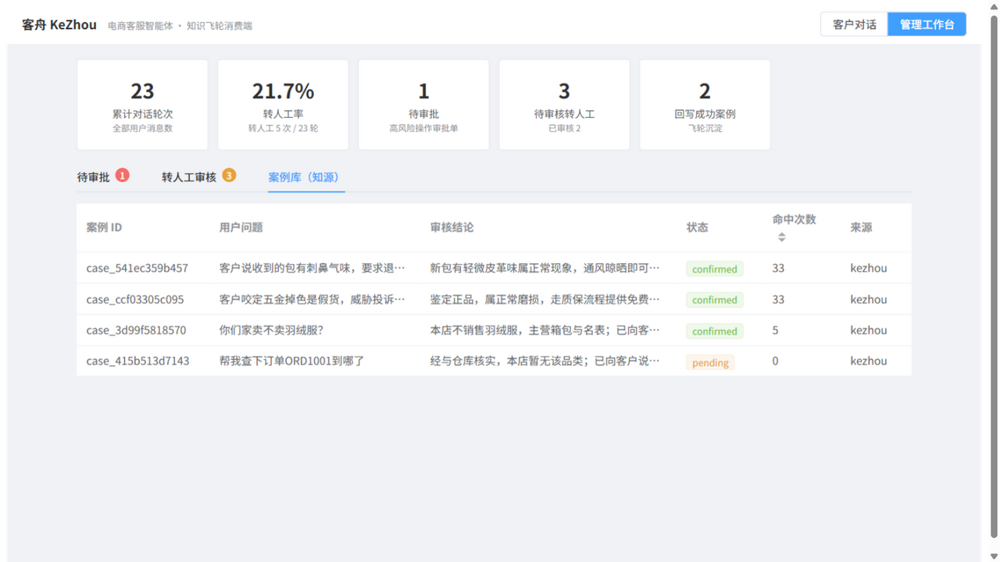
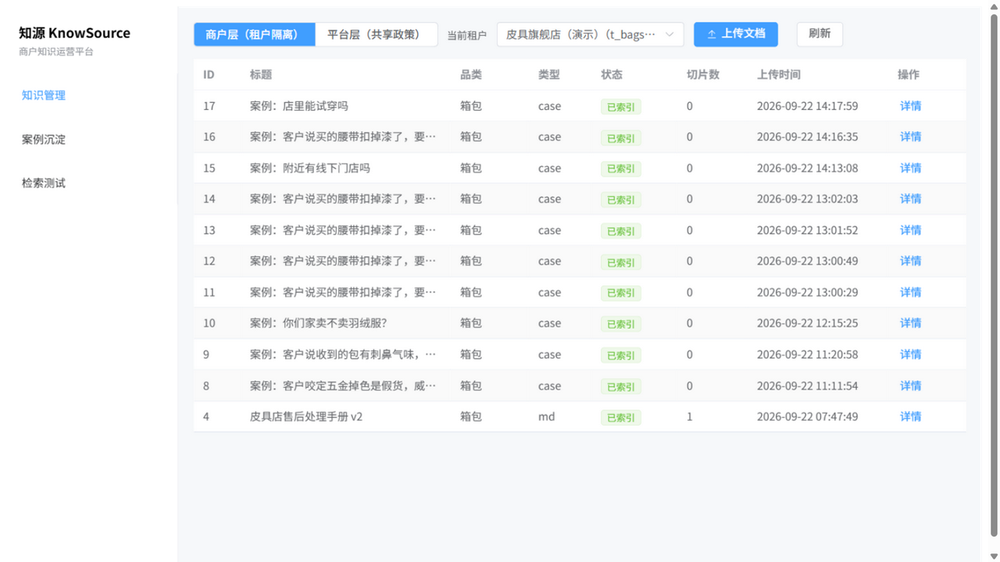
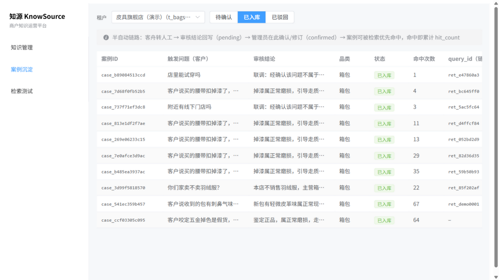
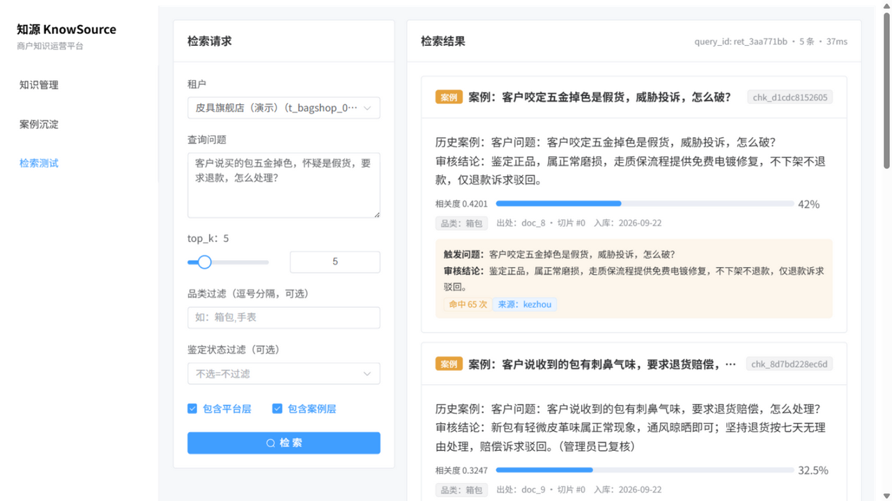
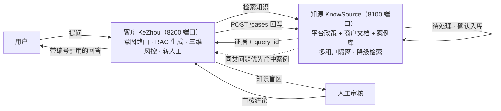
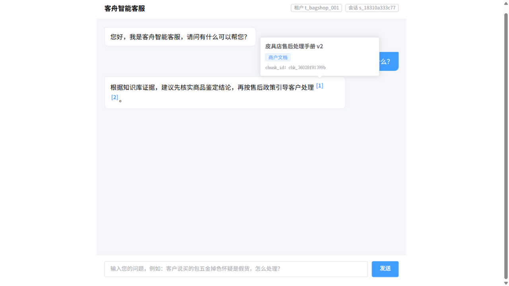

# 知源 & 客舟 · 电商客服数据飞轮

> Knowledge Flywheel for E-commerce CS：一个多租户知识运营平台（知源）+ 一个智能客服（客舟），通过接口契约打通，形成 **知识生产 → 知识消费 → 审核沉淀 → 优先复用** 的数据闭环。
> 已在真实双服务间完成 25 项联调断言全量通过，飞轮闭环全程可复现。



## 它解决什么问题

二手奢侈品电商的客服团队面临三个现实困境：

1. **经验流失**：人工客服处理完"五金掉色是不是假货"这类纠纷，结论只留在对话记录里，下个客服遇到同样问题从零开始。
2. **全自动与全人工之间没有中间态**：退款、鉴假类请求全自动容易资损，全转人工坐席扛不住，缺乏按风险分级的中间路径。
3. **机器人回答无据可查**：用户无法判断"这是系统编的还是政策说的"，答错的代价是纠纷升级。

本仓库用两个协作的服务回答这三个问题。

## 界面一览

| 知源 · 知识管理（双层管理 + 切片预览） | 知源 · 案例沉淀（确认入库前人把关） | 知源 · 检索测试（契约字段溯源卡片） |
|---|---|---|
|  |  |  |

## 架构与数据飞轮



**飞轮闭环（联调实测，非演示数据）**：用户问"你们家卖不卖羽绒服？"→ 知源检索为空 → 客舟转人工（`retrieval_empty`）→ 人工写审核结论回写知源（`query_id` 串联链路）→ 案例确认入库 → **同一问题再问，命中案例自动应答**（回答标注"来自历史审核案例"，不再转人工）。

| 实测项 | 数据 |
|---|---|
| 跨项目联调断言 | **25 项全部通过**（`kezhou/scripts/flywheel_joint_test.py`） |
| 单案例命中计数 | 持续递增（联调实测 20 → 22），工作台可视化 |
| 转人工率 | 实测窗口 21.7%，随案例积累下降 |
| 一轮对话端到端 | 0.5 ~ 0.7s（真实检索 + 生成 + 记忆落库） |
| 测试 | 客舟 58 + 知源 40 个测试函数 |

## 两个项目

### 知源 KnowSource（:8100）—— 多租户知识运营平台

- **多租户硬隔离**：商户层文档与案例按租户过滤，联调实测 B 商户检索不到 A 商户任何文档；平台政策用保留租户实现全局共享。
- **双层知识库 + 案例层**：证据按 **案例 → 商户 → 平台** 分层拼接（平台保底 1 席），案例是飞轮沉淀的高价值资产优先曝光。
- **审核结论沉淀的质量闸**：回写只产生 `pending` 案例，管理员确认后才进入检索索引——沉淀量再大也不会污染知识库。
- **降级不中断**：向量检索故障按预算自动切换 PostgreSQL 全文检索（`degraded=true` 显式标注），3s 总预算超时返回 504。

### 客舟 KeZhou（:8200）—— 电商客服智能体

- **LangGraph 显式状态机**：12 个节点 + 条件边导航，异常路径逐一显式处理——节点只算状态，导航全在图上。
- **三维转人工风控**：按"鉴定状态 × 品类 × 金额"给出三种出口（已鉴定小额自动办理 / 未鉴定高价值强制人工 / 鉴定争议一律人工），每条结论输出逐项可解释的风险因子；退款/改单在图结构上**不存在执行路径**，只能产生审批单。
- **引用溯源**：回答强制带 `[n]` 引用，缺引用先强制重生成、再标记"未验证"；前端点击上标弹出卡片，可查来源标题、层级（平台政策/商户文档/历史案例）与 chunk_id。



- **数据飞轮回写**：转人工按原因分类（检索为空 / 低置信 / 风控 / 情绪 / 基础设施故障），**只有知识盲区类原因**才回写知源——基础设施故障与情绪类 case 不污染案例库；回写失败结论不丢，可重试。
- **管理员工作台**：飞轮指标卡（轮次 / 转人工率 / 待审批 / 回写成功）、待审批队列、转人工审核（写结论即回写）、知源案例库（含命中次数），转人工事件 WebSocket 实时推送。

## 快速开始

前置：Docker、Python 3.11+、Node 18+。

```bash
# 0) 基础设施（PostgreSQL；Chroma 为嵌入式，无需容器）
docker compose up -d postgres

# 1) 知源（:8100）
cd knowsource/backend
python -m venv .venv && . .venv/Scripts/activate   # Linux/macOS: source .venv/bin/activate
pip install -r requirements.txt
cp .env.example .env
alembic upgrade head
python scripts/demo_seed.py          # 两个租户 + 平台层示例知识
uvicorn app.main:app --port 8100

# 2) 客舟（:8200，联调模式：检索与回写都走真实知源）
cd ../../kezhou
python -m venv .venv && . .venv/Scripts/activate
pip install -r requirements.txt
KEZHOU_RETRIEVE_PROVIDER=zhiyuan KEZHOU_WRITEBACK_PROVIDER=zhiyuan \
  uvicorn app.main:app --port 8200

# 3) 前端（客舟工作台与对话窗，:5174）
cd web && npm install && npm run dev
# 知源控制台（可选）：cd knowsource/frontend && npm install && npm run dev  # :5173
```

打开 <http://localhost:5174>，先问一句"客户说买的包五金掉色怀疑是假货，怎么处理？"看带引用的回答；再问一个知识库没有的问题（如"能寄到国外吗"）触发转人工，然后到"管理工作台"完成审核回写，复问即可看到飞轮命中案例。

### 联调验证

```bash
cd kezhou && .venv/Scripts/python.exe -X utf8 scripts/flywheel_joint_test.py
```

覆盖：正常链路（三层证据+引用）/ 检索为空 / 真实超时与断连 / 回写闭环（含知源确认入库后复问命中）/ `include_case` A/B 开关 / 租户隔离 / `hit_count` 增量，共 25 项断言。

### 单元测试

```bash
cd kezhou && .venv/Scripts/python.exe -m pytest -q        # 58 个
cd knowsource/backend && .venv/Scripts/python.exe -m pytest -q   # 40 个
```

## 值得一看的工程决策

- **契约驱动协作**：两服务以 [`docs/接口契约-v1.3.md`](docs/接口契约-v1.3.md) 为唯一依据（统一信封、错误码族、`query_id` 链路键、回写请求体），任何字段变更双会话同步——跨项目联调一次通过 25 项的基础。
- **检索为空 ≠ 检索错误**：空是知识缺失（200 + `retrieved=false`，转人工且回写候选）；错误是基础设施故障（转人工但**永不回写**）。分类错误会让故障噪声污染知识库。
- **SQLite 同文件锁竞争**：checkpointer 与业务表共库时多连接写锁竞争，实测间歇性 11s 停顿乃至死锁；拆分为独立 checkpoint 库后归零（对照实验：同文件 11.07s / 分文件 0.07s）。
- **系统代理劫持内网流量**：Windows 系统代理下 httpx 默认 `trust_env=True` 会把 localhost 请求交给代理，代理对无服务端口返回 503 空体，曾被误判为"契约违约 CRITICAL"。服务间客户端显式 `trust_env=False`，并区分 `GATEWAY_ERROR`（可重试）与 `CONTRACT_VIOLATION`（告警）。
- **错误即分级信号**：鉴权失败/响应结构违约 → CRITICAL 告警；超时/5xx → ERROR；限流 → WARN；CRITICAL 与可重试故障严格分家，告警不刷屏。

## 目录结构

```
├── docker-compose.yml          # 共享基础设施（PostgreSQL）
├── docs/                       # 接口契约 v1.3 · 设计文档 · 截图
├── knowsource/                 # 知源：多租户知识运营平台
│   ├── backend/                #   FastAPI + SQLAlchemy/Alembic + Chroma + PG FTS
│   └── frontend/               #   Vue 3 知识管理控制台
└── kezhou/                     # 客舟：电商客服智能体
    ├── app/                    #   LangGraph 图（12 节点）/ 检索与回写客户端 / 风控规则 / 记忆存储
    ├── scripts/                #   跨项目联调脚本（25 项断言）
    ├── tests/                  #   58 个测试（含真实联调）
    └── web/                    #   Vue 3 + Element Plus（对话窗 + 管理工作台）
```

## Roadmap

- [ ] 在线 embedding 服务替换离线 hash 嵌入（纯配置替换，链路无感）
- [ ] 案例加权重排（契约预留 `boost` 字段）与层内配额，缓解案例库增长后的单层化
- [ ] 知源限流（429）与租户禁用（40301）启用；每租户独立 API Key
- [ ] 坐席工作台扩展：会话接管、审批流升级

## License

[MIT](LICENSE)
